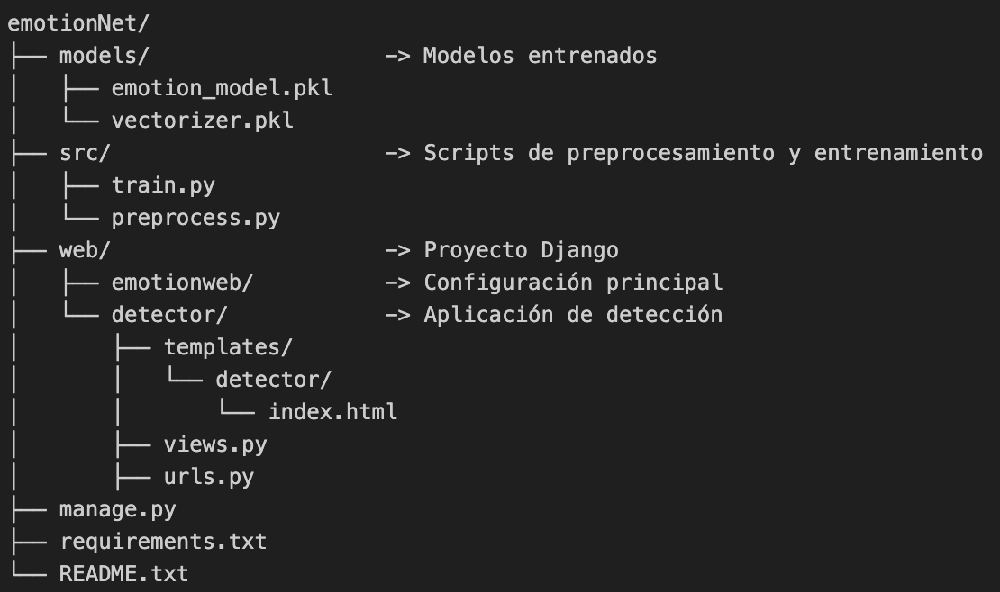

EMOTIONNET - Web App para Detección de Emociones en Texto
==========================================================

Descripción
-----------
EmotionNet es una aplicación web desarrollada con Django que permite detectar emociones en frases en inglés utilizando un modelo de Machine Learning. Se entrena con scikit-learn y convierte texto en vectores usando TfidfVectorizer. Las emociones que puede detectar incluyen: joy, anger, sadness, entre otras.

Estructura del Proyecto
------------------------


Requisitos
----------
- Python 3.13.0 o superior
- Django 5.x
- scikit-learn
- pandas
- joblib

Instalación
-----------
1. Clonar el repositorio:
```
   git clone https://github.com/VicDel05/emotionNet.git
   cd emotionNet
```

2. Crear entorno virtual:
```
   python -m venv venv
   source venv/bin/activate    (en Windows: .\venv\Scripts\activate)
```

3. Instalar dependencias:
```
   pip install -r requirements.txt
```

Entrenar el Modelo (opcional)
-----------------------------
Los archivos emotion_model.pkl y vectorizer.pkl ya están incluidos, pero si deseas entrenar el modelo nuevamente:

1. Desde la carpeta src, ejecutar:
```
   python train.py
```

Esto descarga el dataset, filtra emociones específicas, entrena el modelo y guarda los archivos .pkl en la carpeta models/.

Ejecutar la Aplicación Web
--------------------------
Desde la carpeta web:

1. Aplicar migraciones:
   python manage.py migrate

2. Iniciar el servidor:
   python manage.py runserver

3. Ir al navegador y visitar:
   http://127.0.0.1:8000/

Funcionamiento
--------------
1. El usuario ingresa una frase en inglés.
2. El texto se vectoriza usando TfidfVectorizer.
3. El modelo predice la emoción.
4. Se muestra el resultado en la interfaz web.

Contenido de requirements.txt
-----------------------------
```
Django>=5.0
scikit-learn>=1.3
pandas
joblib
```

Mejoras Futuras
---------------
- Soporte para español
- Aplicación web en Django
- API REST con Django REST Framework
- Interfaz visual mejorada con Bootstrap o Tailwind
- Registro de usuarios e historial de análisis
- Clasificación multietiqueta (más de una emoción por texto)

Autor
-----
Desarrollado por: Victor Delgado
Contacto: victor.delgadobau@gmail.com

Licencia
--------
Este proyecto está licenciado bajo la Licencia MIT.
